# Creación de maquinas virtuales

Esta sección contiene 2 partes:
- [Máquinas Virtuales](#aprendamos-un-poco-sobre-las-máquinas-virtuales)
- [Laboratorio 1](#laboratorio-1-creación-de-máquinas-virtuales)

## Aprendamos un poco sobre las máquinas virtuales 

Oracle Cloud Infrastructure permite aprovisionar y gestionar hosts de cómputo conocidos como instancias. Puedes crear instancias según sea necesario para satisfacer tus requisitos de cómputo y aplicaciones. Después de crear una instancia, puedes acceder a ella de forma segura desde tu computadora, reiniciarla, adjuntar y desvincular volúmenes y cerrarla cuando ya no la necesites. Esto proporciona flexibilidad y escalabilidad para satisfacer las necesidades de tu infraestructura de TI en la nube.

Para saber más, puedes consultar la documentación de OCI 🤓➡️ https://docs.oracle.com/en-us/iaas/Content/Compute/Concepts/computeoverview.htm

## Laboratorio 1: Creación de máquinas virtuales

En este laboratorio, aprenderás a crear 2 máquinas virtuales Linux.

_**Tiempo estimado para el laboratorio**_: 35 minutos

Objetivos:
- Crear un par de claves SSH en OCI Cloud Shell
- Crear 2 máquinas virtuales (VM) Linux
- Acceder a las instancias

**Cada máquina virtual debe estar en un AD diferente**. Para ellos seguiremos los siguientes pasos:
- [Paso 1: Crear 2 máquinas virtuales Oracle Linux](#paso-1-crear-2-máquinas-virtuales-oracle-linux)
- [Paso 2: Acceder a la VM por el terminal](#paso-2-acceder-a-la-vm-por-el-terminal)

     
### Paso 1: Crear 2 máquinas virtuales Oracle Linux

1. En el menú 🍔, vamos a Compute ➡️ Instances
   
2. En "Compute", haz clic en _"Create Instance"_, recuerda verificar que te encuentras en tu compartment correspondiente
   
   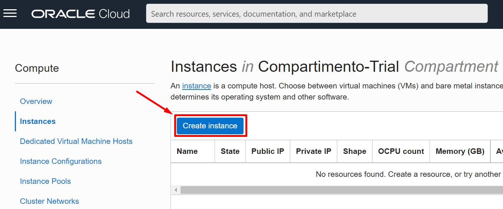

    Estos serán los datos de tu instancia:
    * Nombre de tu instancia: VM-OracleLinux-AD2
    * Dominio de Disponibilidad: AD 2
    * Sistema Operativo: Oracle Linux 7.9
    * Tipo de Instancia: Máquina Virtual
    * Forma de la Instancia: AMD VM.Standard.E4.Flex
    * Elija el Archivo de Clave SSH: Inserta el archivo de clave pública SSH (.pub)
    * Compartimento de la Red de Nube Virtual: "Tu Compartimento"
    * Red de Nube Virtual: "Tu VCN"
    * Compartimento de Subred: "Tu Compartimento" (Creado por defecto en el ambiente)
    * Subred: Subred Pública

     Llena los datos según lo indicado. **Recuerda que ya tienes un compartment creado por defecto. Debes elegir ese** 🤓☝️
   
      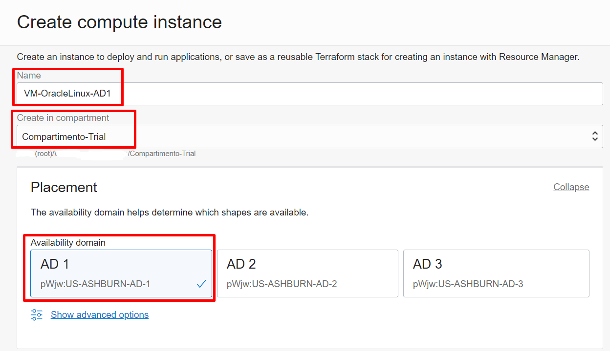
  
      > **Nota:** Recuerda que tus máquinas virtuales deben estar en ADs diferentes. Hay una máquina creada por defecto con el ambiente y que se encuentra en un AD en específico. Las nuevas máquinas deben ser creadas en los otros ADs que quedan
      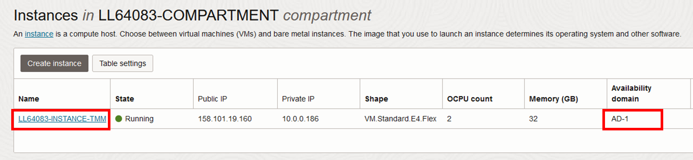
      > _En el ejemplo, la máquina por defecto se encuentra en el AD1 así que las 2 nuevas máquinas deberán ser creadas en el AD 2 y el AD 3_

3. Elige la imagen y el shape de tu MV. Haz clic en _"Change Image"_ para cambiar la imagen y en _"Change shape"_ para cambiar el shape

   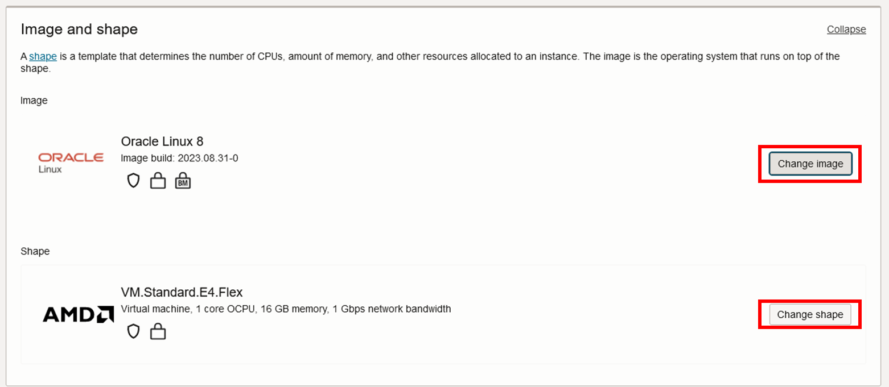

   - Cambiar imagen -> _IMPORTANTE: Seleccionar imagen Oracle Linux 7.9 (no autonomous)_
     
     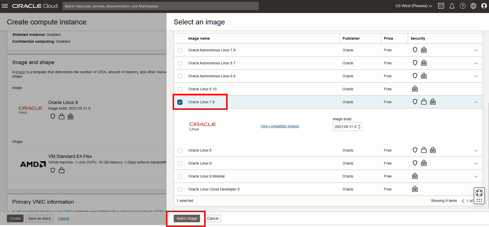

    - Cambiar shape

     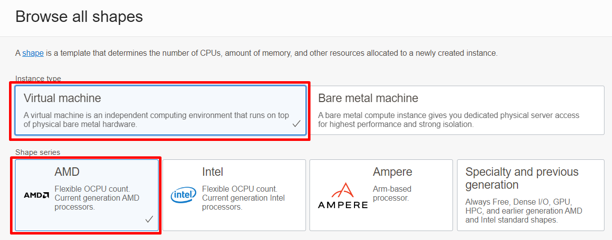
     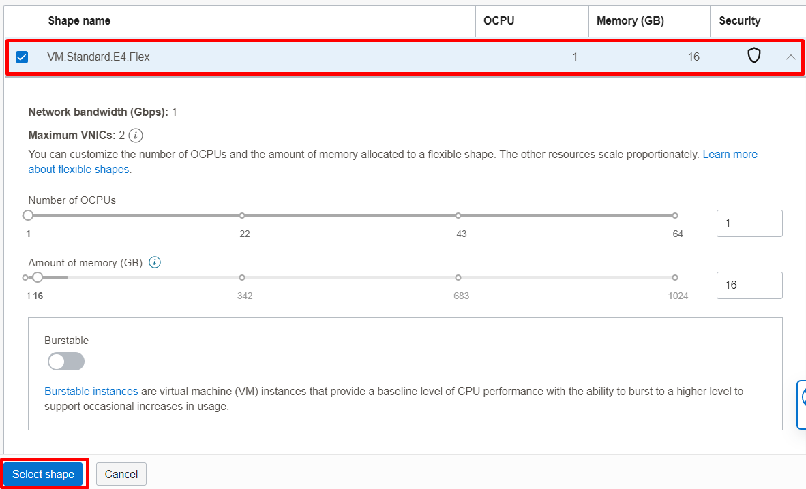

   _Resultado_

    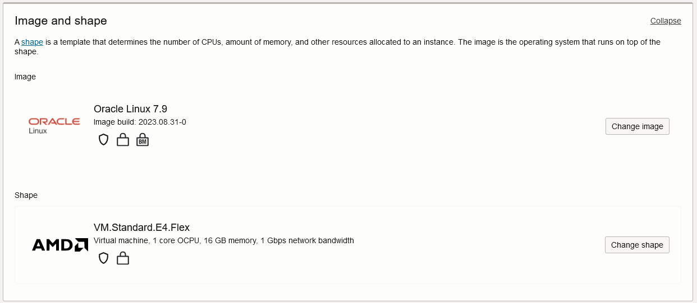

4. Selecciona la VCN y la subnet pública creadas por defecto, y eliga la opción de _"Asignar una dirección IPv4 pública"_

   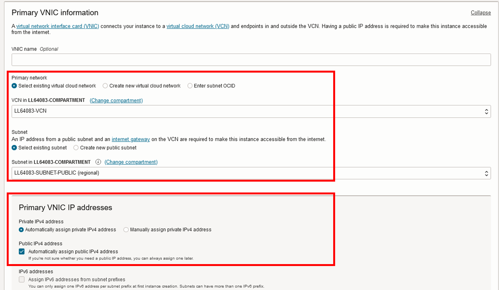

5. ***Guardamos*** la llave pública y privada en nuestro pc que obtenemos desde la consola de OCI
     _Esta llave puede ser utilizada como INPUT en otra VM utilizando la opción "Upload Public Key file"_

   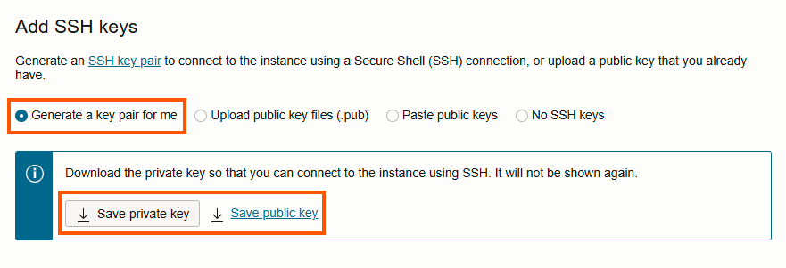

  Le damos click al final en _"Create"_
Tu instancia tomará unos minutos en crearse. Si esta todo OK🤞, quedará como la imagen ⤵️
  
  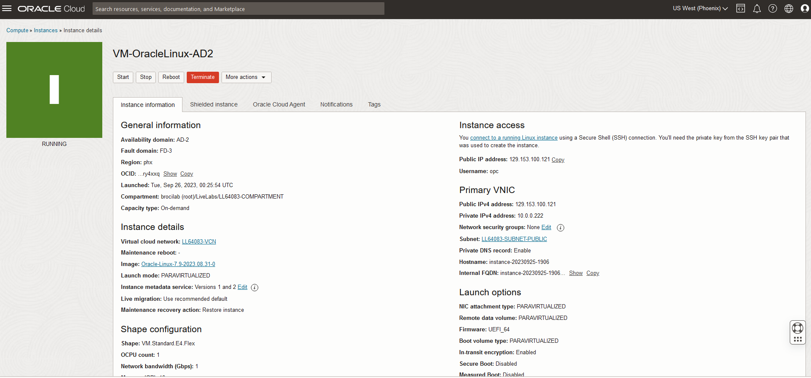

6. Realizamos los mismos pasos para crear la MV2. La crearemos en el AD restante.
   Estos serán los datos de tu instancia:
    * Nombre de tu instancia: VM-OracleLinux-AD3
    * Dominio de Disponibilidad: AD 3
    * Sistema Operativo: Oracle Linux 7.9
    * Tipo de Instancia: Máquina Virtual
    * Forma de la Instancia: AMD VM.Standard.E4.Flex
    * Elija el Archivo de Clave SSH: Inserta el archivo de clave pública SSH (.pub)
    * Compartimento de la Red de Nube Virtual: "Tu Compartimento"
    * Red de Nube Virtual: "Tu VCN"
    * Compartimento de Subred: "Tu Compartimento"
    * Subred: Subred Pública

  ### Paso 2: Acceder a la VM por el terminal

  1. Copiamos la IP privada de una nuestras instancias
     
     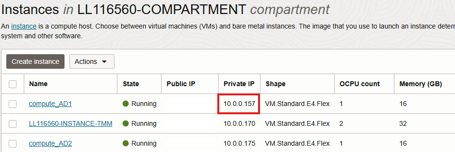

  2. Volvemos al Escritorio Remoto, y en el terminal, hacemos la conexión con la máquina creada usando el siguiente comando

     ```
     ssh -i <llave privada> opc@<ip privado VM>
     ```

     * El usuario por defecto de las instancias Linux es OPC

     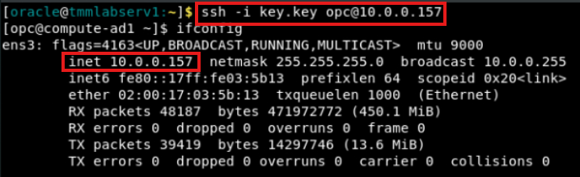

     **Super! Continuemos con el siguiente laboratorio 🤩👉 [Laboratorio 2 - Load Balancer](https://github.com/FeNRiSiTo/oci-QuickLab/blob/main/Lab2-LoadBalancer/Readme.md)**
   
   
